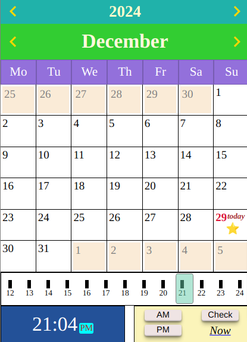

# calendar_component
This project provides a customizable date picker implemented in native JavaScript.



### how to use it?

you should import two file Calendar.zjr.*version*.js and dragMove.zjr.*version*.js in your html.

like:
```html
    <script src="dragMove.zjr.1.0.js"></script>
    <script src="Calendar.zjr.1.0.js"></script>
```
then in your own script codes you can create the calendar easily and quickly by
```javascript
    let calendar =  new Calendar({size: 280});
    document.body.prepend(calendar.node); // put calendar into DOM-Tree
    calendar.show(); // show it
```
### some customized options


|options | description|
|:----|:---|
|size   |  the width of Calendar|
|color |  the color of parts in Calendar|
|startOfWeek | This value specifies the order Calendar show the names of the days of the week.|
|abbreNumOfWeek | This value specifies the number of letters used in the abbreviation of all weekday names.|
